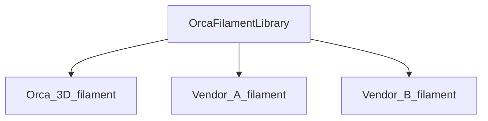

# 指南：为 OrcaSlicer 开发配置文件

## 介绍

本指南将帮助你为 OrcaSlicer 开发配置文件（profile）。

## 总体概览

OrcaSlicer 使用 JSON 文件存储配置文件。共有四种类型：

1. 打印机型号（类型 `machine_model`）。示例：`Orca 3D Fuse1.json`
2. 打印机变体（类型 `machine`）。示例：`Orca 3D Fuse1 0.2 nozzle.json`
3. 耗材（类型 `filament`）。示例：`Generic PLA @Orca 3D Fuse1@.json`
4. 工艺（类型 `process`）。示例：`0.10mm Standard @Orca 3D Fuse1 0.2.json`

此外，每个厂商还有一个整体的元数据文件（`Orca 3D.json`）。

为了便于理解，我们假设一个场景：某打印机制造商名为 `Orca 3D`，推出一款名为 `Fuse 1` 的打印机，支持 0.2/0.4/0.6/0.8mm 喷嘴和市面上常见的耗材。

此场景下：

- 厂商配置文件：`Orca 3D`
- 打印机配置文件：`Orca 3D Fuse1`
- 打印机变体配置文件：`Orca 3D Fuse1 0.4 nozzle`
- 耗材配置文件：`Generic PLA @Orca 3D Fuse1@`
- 工艺配置文件：`0.20mm Standard @Orca 3D Fuse1 0.4`

原则上，配置文件名应与去掉 `.json` 扩展名后的文件名相同。
命名约定：

1. 厂商配置文件：`vendor_name.json`
2. 打印机配置文件：`vendor_name` + `printer_name` + `.json`
3. 打印机变体配置文件：`vendor_name` + `printer_variant_name` + `.json`（其中 `printer_variant_name` 通常包含 `printer_name` + `nozzle_diameter`）
4. 耗材配置文件：`filament_vendor_name` + `filament_name` + " @" + `vendor_name` + `printer_name`/`printer_variant_name` + `.json`
5. 工艺配置文件：`layer_height` + `preset_name` + " @" + `vendor_name` + `printer_name`/`printer_variant_name` + `.json`（`preset_name` 通常包含"standard（标准）""fine（精细）""fast（快速）""draft（草稿）"等）

## 文件结构与模板

配置文件应按以下结构放在 OrcaSlicer 安装目录下：

```plaintext
resources\profiles\
    ├── Orca 3D.json
    └── Orca 3D\
        ├── machine\
        │   ├── Orca 3D Fuse1.json
        │   ├── Orca 3D Fuse1 0.2 nozzle.json
        │   └── Orca 3D Fuse1 0.4 nozzle.json
        ├── process\
        │   ├── 0.10mm Standard @Orca 3D Fuse1 0.2.json
        │   └── 0.20mm Standard @Orca 3D Fuse1 0.4.json
        └── filament\
            └── Generic PLA @Orca 3D Fuse1@.json
```

> [!TIP]
> 文件名中的厂商名尽量简短，避免文件名过长。

> [!NOTE]
> 耗材配置文件是**可选的**。只有厂商针对特定打印机做过专门调校时才创建。详见[耗材配置文件](#耗材配置文件)。

配置文件的模板位于：

```shell
OrcaSlicer\resources\profiles_template\Template
```

这些模板可以作为新打印机、耗材和工艺配置文件的起点。

## 耗材配置文件

OrcaSlicer 有一个名为 `OrcaFilamentLibrary` 的全局耗材库，对所有打印机自动可用。其中包含 `Generic PLA @System`、`Generic ABS @System` 等通用耗材。

打印机厂商可以通过创建新的耗材配置文件，为特定打印机型号覆盖全局库中的某些耗材。

关系图：



> [!IMPORTANT]
> 只有当你真正针对给定打印机对耗材做过专门调校时，才创建新的耗材配置文件。否则请使用全局库。全局库更有可能获得 OrcaSlicer 贡献者的优化和更新，从而使所有打印机的用户受益。

### 向全局库添加耗材配置文件

本节介绍如何向全局库添加新的耗材配置文件。
如果想向全局库添加新的通用配置文件，你需要在 `resources\profiles\OrcaFilamentLibrary\filament` 文件夹中创建一个新文件。如果全局库中已存在基础类型，可以通过继承该文件将其作为基础配置。
下面的示例 JSON 展示如何在全局库中创建新的通用耗材配置文件 `Generic PLA-GF @System`。

1. 第一步是在 `resources\profiles\OrcaFilamentLibrary\filament` 文件夹中创建新文件，文件名为 `Generic PLA-GF @System.json`。请注意，我们将 `compatible_printers` 字段留空，使其对所有打印机可用。

```json
{
    "type": "filament",
    "filament_id": "GFL99",
    "setting_id": "GFSA05",
    "name": "Generic PLA-GF @System",
    "from": "system",
    "instantiation": "true",
    "inherits": "fdm_filament_pla",
    "filament_type": ["PLA-GF"],
    "filament_flow_ratio": [
        "0.96"
    ],
    "compatible_printers": []
}
```

2. 在 `resources\profiles\OrcaFilamentLibrary.json` 中注册该配置文件：

```json
{
    "name": "OrcaFilamentLibrary",
    "version": "02.02.00.04",
    "force_update": "0",
    "description": "Orca Filament Library",
    "filament_list": [
        // ...
        {
            "name": "Generic PLA-GF @System",
            "sub_path": "filament/Generic PLA-GF @System.json"
        }
    ]
}
```

3. 最后一步是验证新添加的耗材配置文件，参见[验证配置文件](#验证配置文件)。

> [!NOTE]
> 如果该耗材兼容 AMS，请确保 `filament_id` 的值**不超过 8 个字符**，以保持 AMS 兼容性。

> [!TIP]
> **测试配置文件改动**
>
> 开发配置文件时，你可能会发现编辑文件后改动没有在 OrcaSlicer 中生效。这是因为 OrcaSlicer 会在系统文件夹中缓存配置文件。
> 要强制 OrcaSlicer 加载更新后的配置文件：
> 1. **打开配置文件夹**：进入 **Help** → **Show Configuration Folder**
>    
> 2. **清除缓存**：删除 `system` 文件夹以移除缓存的配置文件
>    
> 3. **重启 OrcaSlicer**：启动应用程序以加载更新后的配置文件
> 此过程会强制 OrcaSlicer 从 `resources/profiles/` 目录的源文件更新其配置缓存。

### 向打印机厂商库添加耗材配置文件

本节介绍如何为特定厂商添加新的耗材配置文件。
如果你想添加新的耗材配置文件——无论是全新的配置文件，还是针对给定打印机的全局耗材配置的专用版本——你都需要在 `resources\profiles\vendor_name\filament` 文件夹中创建一个新文件。如果全局库中已存在基础类型，可以通过继承该文件将其作为基础配置。
下面是一个示例 JSON，展示如何为 ToolChanger 打印机创建专用的 `Generic ABS` 耗材配置文件。
请注意，与全局库不同，这里必须将 compatible_printers 字段留为非空。

```json
{
    "type": "filament",
    "setting_id": "GFB99_MTC_0",
    "name": "Generic ABS @MyToolChanger",
    "from": "system",
    "instantiation": "true",
    "inherits": "Generic ABS @System",
    "filament_cooling_final_speed": [
        "3.5"
    ],
    "filament_cooling_initial_speed": [
        "10"
    ],
    "filament_cooling_moves": [
        "2"
    ],
    "filament_load_time": [
        "10.5"
    ],
    "filament_loading_speed": [
        "10"
    ],
    "filament_loading_speed_start": [
        "50"
    ],
    "filament_multitool_ramming": [
        "1"
    ],
    "filament_multitool_ramming_flow": [
        "40"
    ],
    "filament_stamping_distance": [
        "45"
    ],
    "filament_stamping_loading_speed": [
        "29"
    ],
    "filament_unload_time": [
        "8.5"
    ],
    "filament_unloading_speed": [
        "100"
    ],
    "compatible_printers": [
        "MyToolChanger 0.4 nozzle",
        "MyToolChanger 0.2 nozzle",
        "MyToolChanger 0.6 nozzle",
        "MyToolChanger 0.8 nozzle"
    ]
}
```

> [!NOTE]
> 如果该耗材兼容 AMS，请确保 `filament_id` 的值**不超过 8 个字符**，以保持 AMS 兼容性。

## 工艺配置文件

工艺配置文件定义打印质量和行为。其结构与耗材配置文件类似：

- 一个公共基础文件（如 `fdm_process_common.json`）作为父级。
- 厂商专用工艺配置文件应通过 `inherits` 字段继承该基础文件。
- 配置文件存储在：

```shell
resources\profiles\vendor_name\process\
```

- **不存在全局工艺配置文件**。
- 每个工艺配置文件包含一个 `"compatible_printers"` 字段，其值为兼容的打印机变体名称数组。

示例：

```json
{
  "type": "process",
  "name": "0.10mm Standard @ExampleVendor Printer 0.2",
  "inherits": "fdm_process_common",
  "from": "system",
  "instantiation": "true",
  "compatible_printers": [
    "ExampleVendor Printer 0.2 nozzle"
  ]
}
```

## 打印机型号配置文件

- 打印机型号配置文件（类型 `machine_model`）描述打印机的通用信息。
- 示例字段：`nozzle_diameter`、`bed_model`、`bed_texture`、`model_id` 等。
- 存储在：

```shell
resources\profiles\vendor_name\machine\
```

- 每个厂商的文件夹中可以包含一张名为以下格式的图片：

```shell
[machine_model_list.name]_cover.png
```

此图片会在 UI 中使用。

型号配置文件示例：

```json
{
  "type": "machine_model",
  "name": "Example M5",
  "nozzle_diameter": "0.2;0.25;0.4;0.6",
  "bed_model": "M5-Example-bed.stl",
  "bed_texture": "M5-Example-texture.svg",
  "model_id": "V1234",
  "family": "Example",
  "machine_tech": "FFF",
  "default_materials": "Example Generic PLA;Example Generic PETG"
}
```

## 打印机变体配置文件

- 打印机变体（类型 `machine`）定义具体的喷嘴配置和机械细节。
- 每个变体必须继承一个公共基础文件，如 `fdm_machine_common.json`。
- 必须在 `nozzle_diameter` 数组中列出兼容的喷嘴直径。
- 示例字段包括 `printer_model`、`printer_variant`、`default_print_profile`、`printable_area` 等。

变体配置文件示例：

```json
{
  "type": "machine",
  "name": "Example M5 0.2 nozzle",
  "inherits": "fdm_machine_common",
  "from": "system",
  "setting_id": "GM001",
  "instantiation": "true",
  "nozzle_diameter": ["0.2"],
  "printer_model": "Example M5",
  "printer_variant": "0.2",
  "default_filament_profile": ["Example Generic PLA"],
  "default_print_profile": "0.10mm Standard 0.2mm nozzle @Example",
  "printable_area": ["0x0", "235x0", "235x235", "0x235"],
  "nozzle_type": "brass"
}
```

## 模型

- 厂商文件夹下的 `model` 目录的用途与 `machine` 配置文件类似。
- 用于存放额外的打印机相关 3D 模型或定义，存储在：

```shell
resources\profiles\vendor_name\model\
```

## 厂商元数据文件

```shell
resources\profiles\vendor_name.json
```

每个厂商必须在 `resources\profiles` 目录中包含一个名为 `vendor_name.json` 的 JSON 文件。此文件列出所有可用的型号、变体、工艺和耗材：

示例：

```json
{
  "name": "ExampleVendor",
  "version": "01.00.00.00",
  "force_update": "1",
  "description": "Example configuration",
  "machine_model_list": [
    {
      "name": "Example M5",
      "sub_path": "machine/Example M5.json"
    }
  ],
  "machine_list": [
    {
      "name": "fdm_machine_common",
      "sub_path": "machine/fdm_machine_common.json"
    }
  ],
  "process_list": [
    {
      "name": "fdm_process_common",
      "sub_path": "process/fdm_process_common.json"
    }
  ],
  "filament_list": [
    {
      "name": "fdm_filament_common",
      "sub_path": "filament/fdm_filament_common.json"
    }
  ]
}
```

## 验证配置文件

你可以使用 **OrcaSlicer 配置验证器**和 **Python 验证脚本**验证配置文件。这两个工具检查配置文件的不同方面，因此都应执行并通过且无错误，以确保完全兼容。

> [!NOTE]
> **✅ 建议：** 始终**同时**运行 OrcaSlicer 验证器和 Python 脚本，以确保配置文件在所有方面均有效。

### 1. OrcaSlicer 配置验证器

你可以运行 OrcaSlicer 来验证刚添加的耗材是否可用。你也可以使用 [Orca 配置验证器](https://github.com/SoftFever/Orca_tools/releases/tag/1)工具帮助调试错误。

> [!IMPORTANT]
> 你需要删除 `%appdata%/OrcaSlicer/system` 文件夹，以强制 OrcaSlicer 重新加载你的最新改动。

如果要向全局库添加新的品牌耗材配置文件，流程相同。你需要在 `resources\profiles\OrcaFilamentLibrary\filament\brand_name` 文件夹中创建一个新文件。唯一的区别是应将文件放入该品牌自己的子文件夹中。

#### 用法

```shell
-h [ --help ] help
-p [ --path ] arg profile folder
-v [ --vendor ] arg Vendor name. Optional, all profiles present in the folder will be validated if not specified
-l [ --log_level ] arg (=2) Log level. Optional, default is 2 (warning). Higher values produce more detailed logs.
```

#### 示例

```shell
./Snapmaker_Orca_profile_validator -p ~/codes/OrcaSlicer/resources/profiles -l 2 -v Custom
```

#### 带错误的示例结果

```shell
PS D:\codes\OrcaSlicer> ."D:/codes/OrcaSlicer/build/src/Release/Snapmaker_Orca_profile_validator.exe" --path d:\codes\OrcaSlicer\resources\profiles -l 2 -v Custom
[2024-02-28 21:23:06.102138] [0x0000a4e8] [error]   Slic3r::ConfigBase::load_from_json: parse d:\codes\OrcaSlicer\resources\profiles/Custom/machine/fdm_klipper_common.json got a nlohmann::detail::parse_error, reason = [json.exception.parse_error.101] parse error at line 9, column 38: syntax error while parsing object - unexpected string literal; expected '}'
...
Validation failed
```

#### 成功的示例结果

```shell
PS D:\codes\OrcaSlicer\build\src\RelWithDebInfo> ."D:/codes/OrcaSlicer/build/src/Release/Snapmaker_Orca_profile_validator.exe" --path d:\codes\OrcaSlicer\resources\profiles -l 2 -v Custom
Validation completed successfully
```

> [!WARNING]
> 在 Ubuntu 上使用 `Snapmaker_Orca_profile_validator`，在 Windows 上使用 `Snapmaker_Orca_profile_validator.exe`。

---

### 2. Python 配置验证脚本

除 Orca 验证器外，你还应运行 `orca_extra_profile_check.py` 脚本。此脚本执行额外的检查，例如：

- 验证耗材配置文件中的 `compatible_printers`
- 耗材名称的一致性
- 验证打印机配置文件中的默认材料（可选）

#### 示例命令

```shell
python ./orca_extra_profile_check.py
```

你还可以启用或禁用特定检查：

- `--help`：显示帮助信息
- `--vendor`（可选）：只检查指定的厂商。省略时检查所有厂商。
- `--check-filaments`（默认启用）：检查耗材配置文件中的 `compatible_printers` 字段
- `--check-materials`：检查打印机配置文件中的默认材料名称
- `--check-obsolete-keys`：检查配置文件中的过时键

#### 启用所有检查的示例用法

```shell
python ./orca_extra_profile_check.py --vendor="vendor_name" --check-filaments --check-materials
```

脚本会输出发现的错误数量，如果检测到任何问题，将以非零状态码退出。
