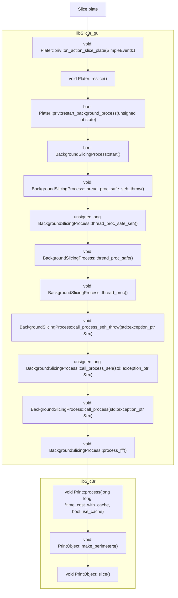

## 切片调用层次

切片逻辑在代码库中不太好定位。下面是在 UI 中点击 `Slice Plate` 按钮后发生的函数调用流程图。大部分处理在不同的线程中进行。注意 `BackgroundSlicingProcess::start()` 之后的调用，通过它你可以找到切片逻辑。

```mermaid
flowchart TD
    A["Slice plate"] --> B["void Plater::priv::on_action_slice_plate(SimpleEvent&)"]
    B --> C["void Plater::reslice()"]
    C --> D["bool Plater::priv::restart_background_process(unsigned int state)"]
    D --> E["bool BackgroundSlicingProcess::start()"]
    E --> F["void BackgroundSlicingProcess::thread_proc_safe_seh_throw()"]
    F --> G["unsigned long BackgroundSlicingProcess::thread_proc_safe_seh()"]
    G --> H["void BackgroundSlicingProcess::thread_proc_safe()"]
    H --> I["void BackgroundSlicingProcess::thread_proc()"]
    I --> J["void BackgroundSlicingProcess::call_process_seh_throw(std::exception_ptr &ex)"]
    J --> K["unsigned long BackgroundSlicingProcess::call_process_seh(std::exception_ptr &ex)"]
    K --> L["void BackgroundSlicingProcess::call_process(std::exception_ptr &ex)"]
    L --> M["void BackgroundSlicingProcess::process_fff()"]
    M --> N["void Print::process(long long *time_cost_with_cache, bool use_cache)"]
    N --> O["void PrintObject::make_perimeters()"]
    O --> P["void PrintObject::slice()"]

    %% Labels for libraries
    subgraph G1 [libSlic3r_gui]
        B
        C
        D
        E
        F
        G
        H
        I
        J
        K
        L
        M
    end

    subgraph G2 [libSlic3r]
        N
        O
        P
    end
```
